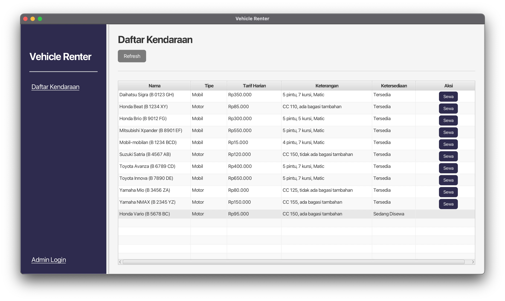
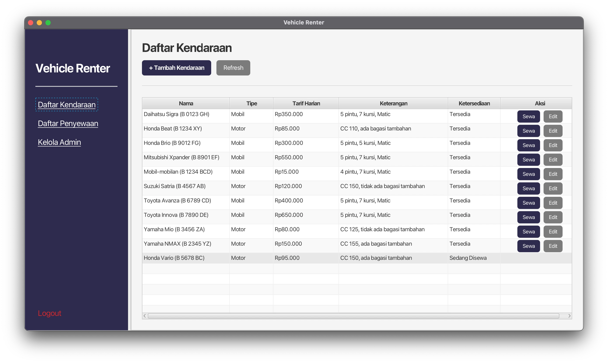
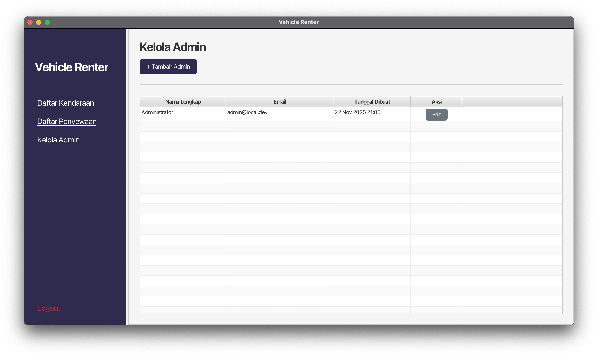

# Vehicle Renter, Aplikasi Manajemen Rental Kendaraan

Aplikasi desktop untuk mengelola penyewaan kendaraan (mobil dan motor) dengan antarmuka yang mudah digunakan. Dibangun menggunakan JavaFX, PostgreSQL, dan jOOQ.

## Fitur Utama

- **Manajemen Kendaraan**: Tambah, edit, dan lihat daftar kendaraan (mobil & motor)
- **Sistem Rental**: Proses penyewaan dengan status tracking (Pending → Renting → Returned)
- **Manajemen Admin**: Kelola akun administrator
- **Persetujuan Rental**: Admin dapat menyetujui/menolak permintaan sewa
- **Pelacakan Status**: Monitor status kendaraan (Tersedia, Booked, Sedang Disewa)

## Teknologi

- **Java 19+** dengan JavaFX 25
- **PostgreSQL** sebagai database
- **jOOQ** untuk type-safe database access
- **Maven** untuk build management
- **Docker** untuk PostgreSQL container

## Prasyarat

Sebelum menjalankan aplikasi ini, Anda perlu menginstal beberapa software berikut:

### 1. Docker Desktop

Docker digunakan untuk menjalankan database PostgreSQL.

#### **Instalasi Docker Desktop:**

**Windows & Mac:**
1. Kunjungi [https://www.docker.com/products/docker-desktop](https://www.docker.com/products/docker-desktop)
2. Download Docker Desktop untuk sistem operasi Anda
3. Jalankan installer dan ikuti petunjuk instalasi
4. Setelah selesai, buka Docker Desktop dan tunggu hingga berjalan
5. Verifikasi instalasi dengan menjalankan di terminal/command prompt:
   ```bash
   docker --version
   ```

### 2. OpenJDK 19 atau lebih baru

Java Development Kit diperlukan untuk menjalankan aplikasi.

#### **Instalasi OpenJDK:**

**Mac (menggunakan Homebrew):**
```bash
# Install Homebrew jika belum ada
/bin/bash -c "$(curl -fsSL https://raw.githubusercontent.com/Homebrew/install/HEAD/install.sh)"

# Install OpenJDK
brew install openjdk@21

# Tambahkan ke PATH (tambahkan ke ~/.zshrc atau ~/.bash_profile)
echo 'export PATH="/opt/homebrew/opt/openjdk@21/bin:$PATH"' >> ~/.zshrc
source ~/.zshrc
```

**Windows:**
1. Kunjungi [https://adoptium.net/](https://adoptium.net/)
2. Download **Temurin JDK 21** (atau versi terbaru)
3. Jalankan installer (.msi file)
4. Pilih opsi "Add to PATH" saat instalasi
5. Verifikasi instalasi:
   ```cmd
   java -version
   ```

**Linux (Ubuntu/Debian):**
```bash
sudo apt update
sudo apt install openjdk-21-jdk
```

**Verifikasi Java terinstal:**
```bash
java -version
# Output: openjdk version "21..." atau lebih baru
```

### 3. Maven (Opsional)

Maven biasanya sudah termasuk dalam IDE modern seperti IntelliJ IDEA atau VS Code dengan extension Java. Namun jika ingin install secara manual:

**Mac:**
```bash
brew install maven
```

**Windows:**
1. Download dari [https://maven.apache.org/download.cgi](https://maven.apache.org/download.cgi)
2. Extract ke folder (misalnya `C:\Program Files\Maven`)
3. Tambahkan ke PATH environment variable

## Cara Menjalankan Aplikasi

### Untuk Pengguna Mac

1. **Clone atau download repository ini**
   ```bash
   git clone https://github.com/adisatr7/VehicleRenter
   cd VehicleRenter
   ```

2. **Pastikan Docker Desktop sudah berjalan**
   - Buka Docker Desktop dan tunggu hingga status menunjukkan "running"

3. **Jalankan script startup**
   ```bash
   chmod +x run-on-mac.sh
   ./run-on-mac.sh
   ```

   Script ini akan:
   - Menjalankan database PostgreSQL dengan Docker
   - Membuild aplikasi
   - Menjalankan aplikasi JavaFX

### Untuk Pengguna Windows

1. **Clone atau download repository ini**
   ```cmd
   git clone https://github.com/adisatr7/VehicleRenter
   cd VehicleRenter
   ```

2. **Pastikan Docker Desktop sudah berjalan**
   - Buka Docker Desktop dan tunggu hingga status menunjukkan "running"

3. **Edit file pom.xml**

   Buka file `pom.xml` dan cari baris berikut (sekitar baris 90-95):
   ```xml
   <classifier>mac</classifier>
   ```

   Ganti menjadi:
   ```xml
   <classifier>win</classifier>
   ```

4. **Jalankan script startup**
   ```cmd
   run-on-windows.bat
   ```

   Script ini akan:
   - Menjalankan database PostgreSQL dengan Docker
   - Membuild aplikasi
   - Menjalankan aplikasi JavaFX

## Panduan Penggunaan

### Untuk Pelanggan (Penyewa)



1. **Lihat Kendaraan**:
   - Buka aplikasi (tidak perlu login)
   - Lihat daftar kendaraan yang tersedia
2. **Sewa Kendaraan**:
   - Klik tombol "Sewa" pada kendaraan yang diinginkan
   - Isi formulir dengan data diri dan pilih tanggal sewa
   - Submit formulir
   - Tunggu persetujuan dari admin

### Untuk Admin




1. **Login** dengan kredensial admin
   - Email: `admin@local.dev`
   - Password: `admin123`
2. **Kelola Kendaraan**:
   - Klik "Daftar Kendaraan" di sidebar
   - Klik "Tambah Kendaraan" untuk menambah kendaraan baru
   - Klik "Edit" pada kendaraan untuk mengubah data
3. **Kelola Rental**:
   - Klik "Daftar Rental" di sidebar
   - Lihat semua permintaan rental
   - Klik "Setujui" untuk menyetujui rental (status: PENDING → RENTING)
   - Klik "Tolak" untuk menolak rental
   - Klik "Selesai" ketika kendaraan dikembalikan (status: RENTING → RETURNED)
4. **Kelola Admin (khusus Admin)**:
   - Klik "Kelola Admin" di sidebar
   - Tambah admin baru atau edit admin yang sudah ada

## Struktur Database

Aplikasi menggunakan 3 tabel utama:
- **admins**: Data administrator
- **vehicles**: Data kendaraan (mobil & motor)
- **rentals**: Data transaksi rental

Data seeder otomatis akan membuat:
- 1 akun admin default
- Beberapa contoh kendaraan

## Troubleshooting

### Port 5432 sudah digunakan
Jika mendapat error "port 5432 already in use":
```bash
# Hentikan container PostgreSQL yang sedang berjalan
docker-compose down

# Atau hentikan semua PostgreSQL yang berjalan
docker stop $(docker ps -q --filter ancestor=postgres)
```

### Aplikasi tidak bisa connect ke database
1. Pastikan Docker Desktop sudah berjalan
2. Pastikan container PostgreSQL sudah running:
   ```bash
   docker ps
   ```
   Harus ada container dengan nama yang mengandung "postgres"

### Java version tidak sesuai
Pastikan Java version minimal 19:
```bash
java -version
```
Jika masih menggunakan Java versi lama, install OpenJDK yang lebih baru.

### Maven build gagal
Coba clean dan rebuild:
```bash
mvn clean install
```

## Catatan Tambahan

### Regenerate jOOQ Classes

Jika Anda mengubah schema database, regenerate jOOQ classes:
```bash
mvn clean generate-sources
```

### Stop Database

Untuk menghentikan database PostgreSQL:
```bash
docker-compose down
```

### View Database

Untuk melihat isi database, Anda bisa menggunakan:
- **pgAdmin** (GUI tool untuk PostgreSQL)
- **DBeaver** (Universal database tool)
- **psql** (Command line):
  ```bash
  docker exec -it <container-name> psql -U postgres -d vehicle_renter
  ```

## Kontributor

Project ini dibuat untuk pembelajaran dengan JavaFX dan jOOQ.

## Lisensi

Project ini dibuat untuk tujuan edukasi.

---

Selamat mencoba! Jika ada pertanyaan atau masalah, silakan buat issue di repository ini.
